madis - Manipulating and Analyzing Data Interactively with Shiny
================================================================

madis is an open-source platform-independent browser-based interface for
data manipulating and analyzing in [R](http://www.r-project.org/). The
application is based on [Shiny](http://www.rstudio.com/shiny/) and can
be run locally or on a server. Please use the issue tracker on GitHub to
suggest enhancements or report problems.

launch app
----------

There are chinese and english versions.

`Madis(wd=getwd(),lang='ch')` for chinese version.

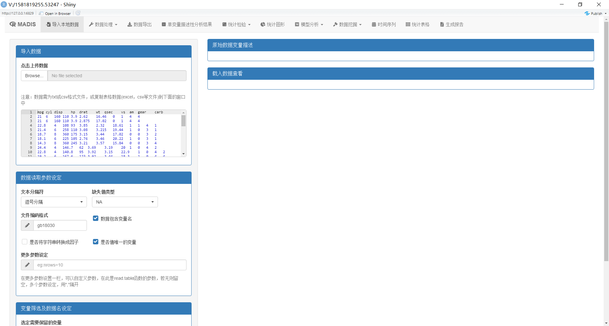

`Madis(wd=getwd(),lang='en')` for english version.

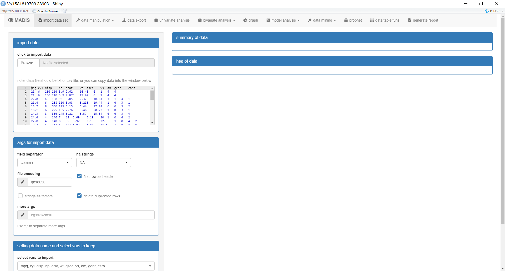

Key features
------------

-   Data manipulating: Data cleaning, integration, conversion, and
    reduction.
-   Univariate analysis: provide basic statistics for univariate
    analysis, such as mean, sd, median, quantile, frequency table,
    histogram, bar chart.
-   Bivariate test: provide baisc hypothesis test, including t.test,
    wilcox.test, chisq.test, fisher.test, aov, kruskal.test, and also
    generate table1 in table 1 menu.
-   Modeling: Sevral classic statistical models are applied to conduct
    high-quality analysis, such as GLM, coxph, rpart, ctree.
-   Data Mining: Sevral DM methods are included in madis, such as
    Kmeans, PCA, FA.
-   Customize: The results of different kinds of analysis can be
    selected whether or not generated in a final report(PDF,Word,and
    HTML)
-   sum useful Quick shiny functions: provide some quick functions based
    on shiny, qDT, qGraph, qTable.

### Data manipulating

You could use several data manipulating functions in `data manipulation`
menu.

-   change variable rename
-   generate new variable
-   change variable mode
-   data reshape (reshape2)
-   join or bind two data.frames
-   impute na value using mice function.
-   subsetting the data

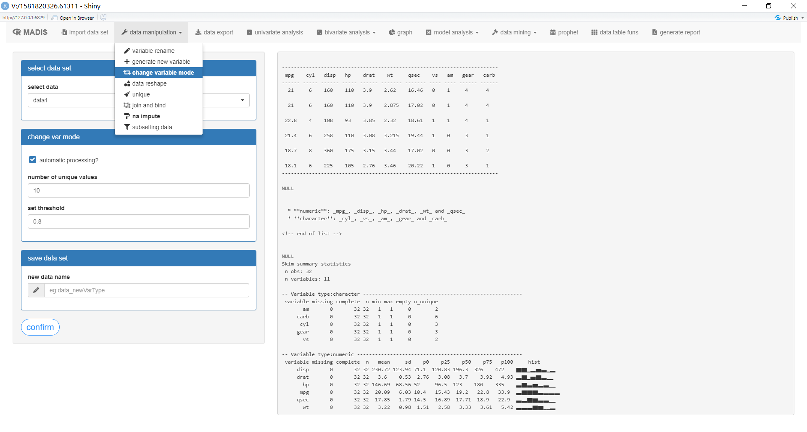

### Univariate analysis

The univaraite analysis provides basic univariate descriptive analysis.
The results are automaticlly generated according to the distribution of
the selected variable.

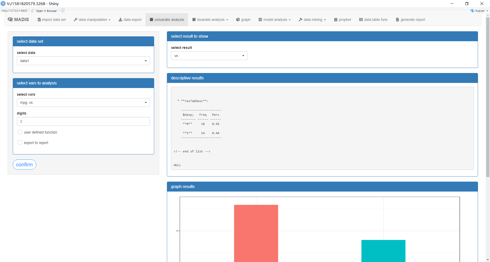

### Bivariate analysis

Bivariate analysis provides automaticlly hypothesis test for two (or
one) variables, including hypothesis test for one sample, two
independent samples or matched samples. Different hypothesis test
methods are used according to the distribution of the sample. You could
see `help(hTest)` for more detail.

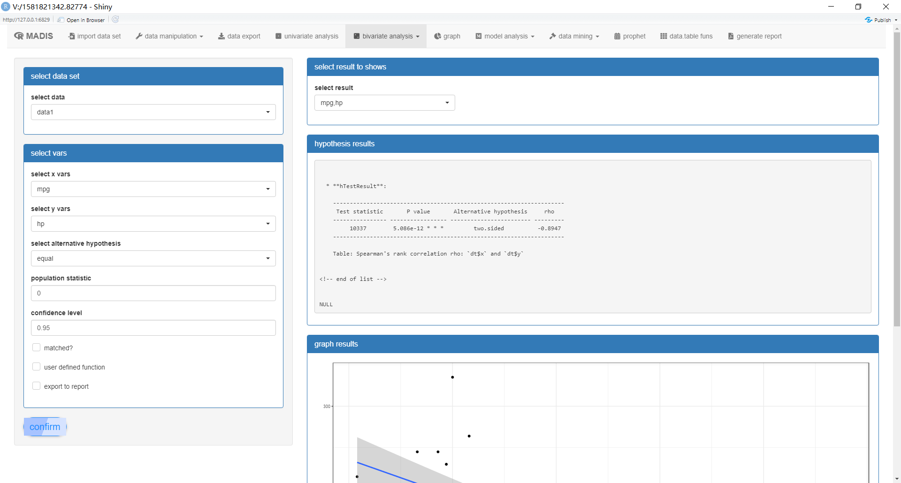

### Modeling

To conduct high-quality analysis, statistical model should be used. In
madis, you can select models such as linear model, cox proportional
hazards model, decision tree model, mixed model, clustering analysis,
principal component analysis, factor analysis, propensity score
matching, and time-series model to find deep relationships between
independent variables and dependent variable.

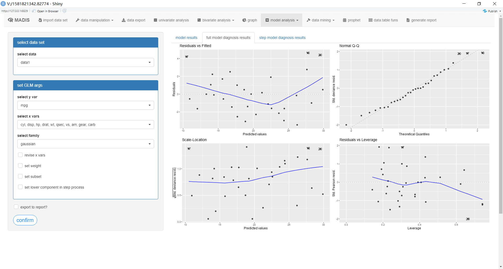

### Programming

Although madis’s web-interface can handle quite a few data and analysis
tasks, you may prefer to write your own R-code. madis provides a bridge
to progamming in R(studio) by exporting the functions used for analysis
(i.e., you can select the button `Custom function?` to create your own
function in madis).

### Customize

madis can create a report (PDF,Word,and HTML) using
[Rmarkdown](http://rmarkdown.rstudio.com/). You can customize your
report by using the button (`Whether to export the report`) in each
module. madis also provides an output interface in each module so you
can easily get the intermediate result to alaysis or write it into your
report.

### How to install madis

-   Required: [R](https://cran.rstudio.com/) version 3.3.0 or later
-   Required: A modern browser (e.g.,
    [Chrome](https://www.google.com/intl/en/chrome/browser/desktop/) or
    Safari). Internet Explorer (version 11 or higher) should work as
    well
-   Required: latex or miketex if you want generate a pdf report.

To install the latest version of madis for Windows or Mac, with complete
documentation for off-line access, open R(studio) and copy-and-paste the
command below:

``` r
devtools::install_github("sontron/madis")
```

Once all packages are installed use the command below to launch the app:

``` r
Madis(wd=getwd(),lang='en')  # where lang could be en(english version) or cn(chinese version).
```

Reporting issues
----------------

Please use the GitHub issue tracker at
<a href="https://github.com/sontron/madis/issues" target="_blank">github.com/radiant-rstats/radiant/issues</a>
if you have any problems using madis.

Credits
-------

madis would not be possible without [R](https://cran.rstudio.com/) and
[Shiny](http://shiny.rstudio.com/). Other key components used in madis
are ggplot2, shinyAce, shiny, shinythemes, shinyWidgets, stringi,
reshape2, vcdExtra, pander, rmarkdown, rms, ggfortify, party, partykit,
rpart, moonBook, fBasics, plotly, prophet, skimr, rio, rhandsontable,
ROCR.

License
-------

If you are interested in using madis please email me at
<a href="mailto:sontron@foxmail.com" class="email">sontron@foxmail.com</a>

madis - Manipulating and Analyzing Data Interactively with Shiny
================================================================

madis目前是基于[R](http://www.r-project.org/)和[Shiny](http://www.rstudio.com/shiny/)以及常见的统计分析包搭建而成的，能够提供数据的交互式处理(包括数据整理、清洗、变量操作、字符串操作等)、数据统计分析、模型分析、数据挖掘、以及一键生成分析报告。

运行
----

madis包含了中文和英文版本， 参数lang分别定义了两种语言的版本。

中文版本请运行`Madis(wd=getwd(),lang='ch')` .


若使用英文版本请运行`Madis(wd=getwd(),lang='en')` .


主要特征
--------

-   数据操作: 数据清洗、变形、整理、新变量生成等
-   单变量分析:
    单变量分析主要是进行单个变量的描述性分析，提供均值、标准差、中位数、频数表、直方图、条图等结果.
-   双变量分析:
    双变量分析主要进行假设检验和生成期刊常用的table1（描述性分析表），假设检验可以根据数据的类型及分布自动选择检验方法，比如t检验，秩和检验，卡方检验，fisher精确概率检验，方差分析，相关性检验等。
-   模型分析:
    模型分析提供了广义线性模型（普通线性回归、logistic线性回归、泊松回归）、决策树分析（rpart算法和ctree算法）、生存分析（主要是cox模型）等方法
-   分析报告:
    用户可以自行选择生成报告的结果，一键导入报告中，并生成不同格式的报告（PDF、Word、HTML），若生成pdf则需要安装tex软件。
-   同时提供了一些快速的shiny小程序:
    比如qDT（用以查看数据），qGraph(快速生成ggplot图形)，qTable(data.table的一些功能)。

### 数据操作

数据操作提供了一些常用的数据操作的功能：

-   修改变量名
-   生成新的变量
-   更改变量类型
-   数据变形（reshape包的功能）
-   数据的合并（包含merge和bind两种情形）
-   缺失值填补（mice包）
-   数据的截取

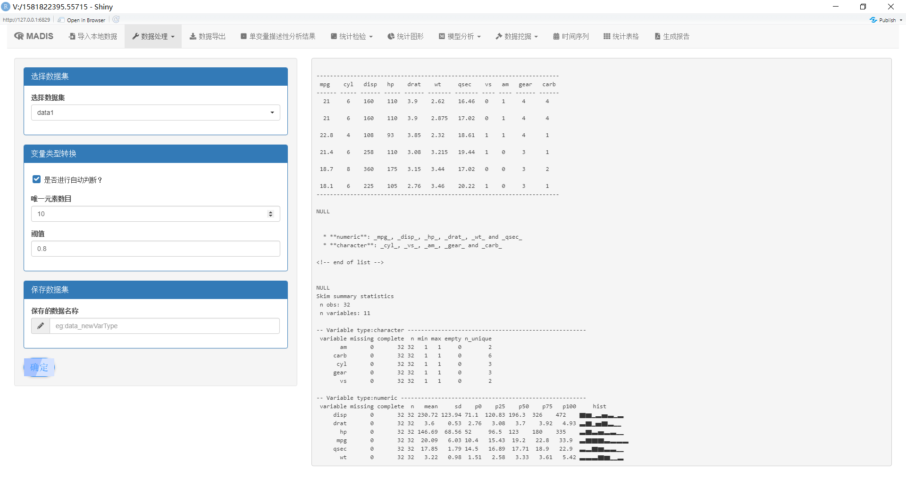

### 单变量描述性分析

单变量分析主要提供单变量的描述性分析结果，主要包含常见的均值、标准差、中位数、四分位数间距、频数表；直方图、条图等

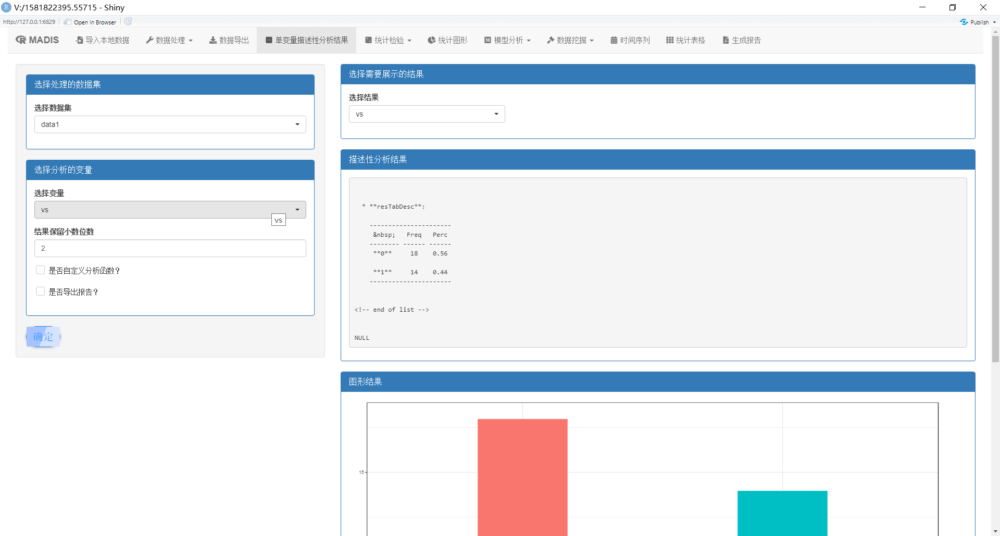

### 双变量描述性分析

双变量分析主要提供了常见的假设检验方法，并能根据数据的类型和数据的分布进行统计方法的自动选择。统计方法包括：t检验、方差分析、wilcoxon秩和检验、相关性检验、配对t检验、配对秩和检验，卡方检验、fisher检验，CMH检验等方法。

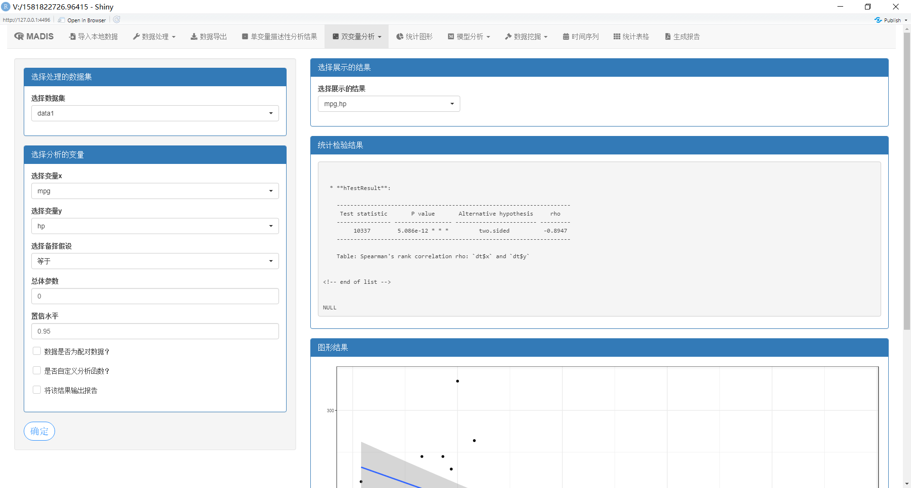

描述性统计表提供了一键生成汇总统计表的功能，常见于各类期刊的table1.

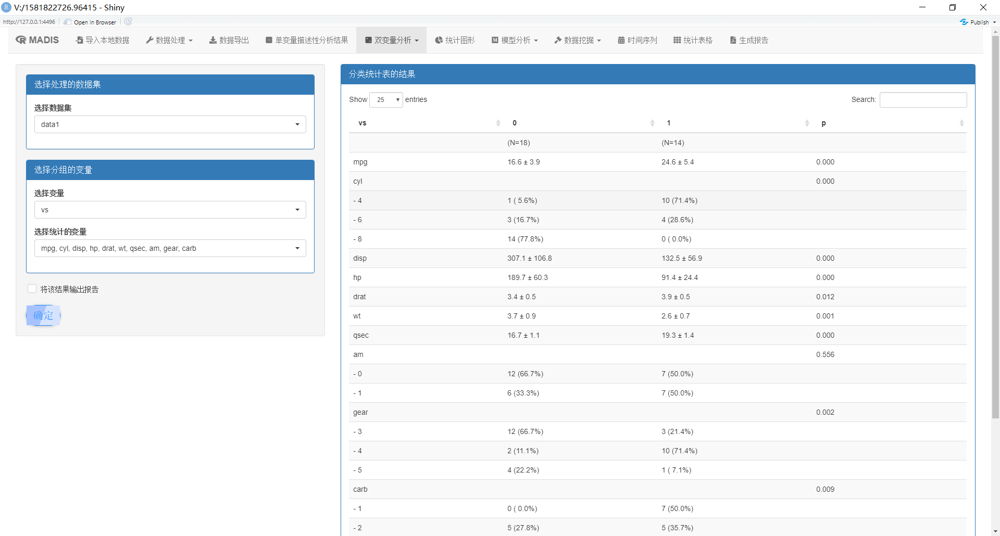

### 模型分析

模型分析包含了线性模型（普通线性模型、logistic模型、泊松回归模型）、决策树模型、cox模型和混合效应模型。

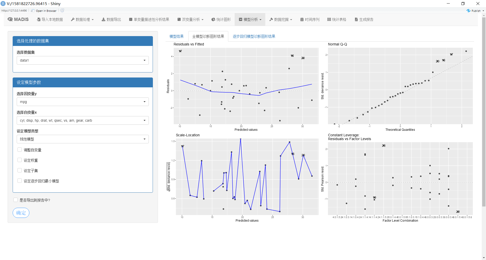

### 自定义分析函数

madis提供了完善的统计分析函数，但是也提供了一定的灵活性，用户可以自行定义一些分析中的参数，如在模型分析中，用户可以调整自变量，以实现更加灵活的分析

### 统计分析报告

madis可以将结果导出到报告中，方便用户进行查阅、分析以及交流使用。

### 如何安装

-   要求: [R](https://cran.rstudio.com/)3.3.0以上版本

-   可选:
    若需要生成pdf文档，则需要安装tex软件，常见的是texlive或miketex。

运行以下命令进行安装：

``` r
devtools::install_github("sontron/madis")
```

``` r
Madis(wd=getwd(),lang='ch')  
```
